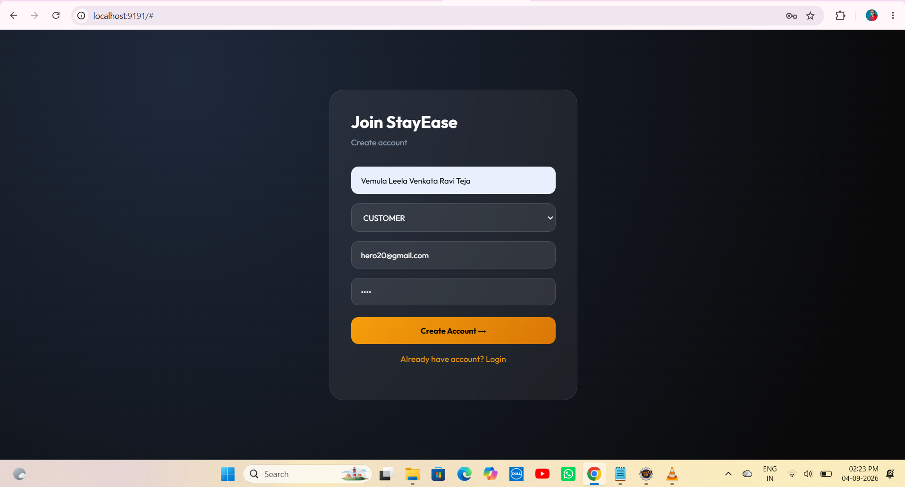
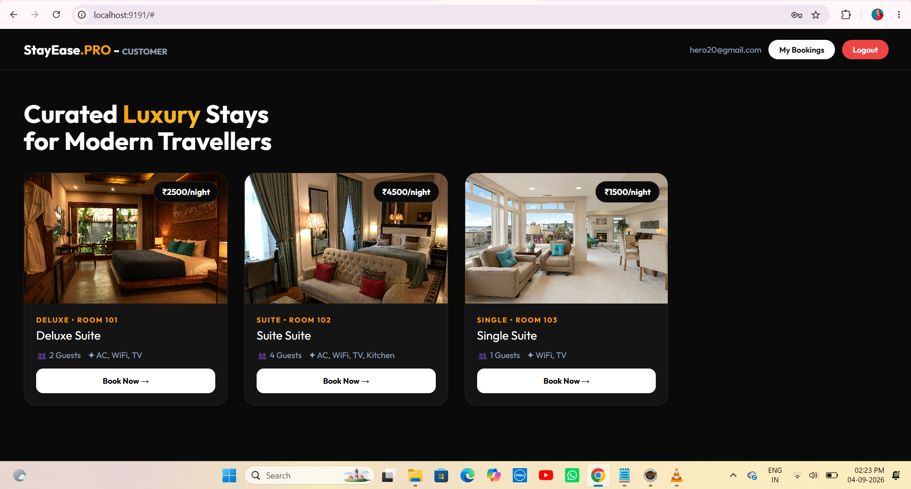
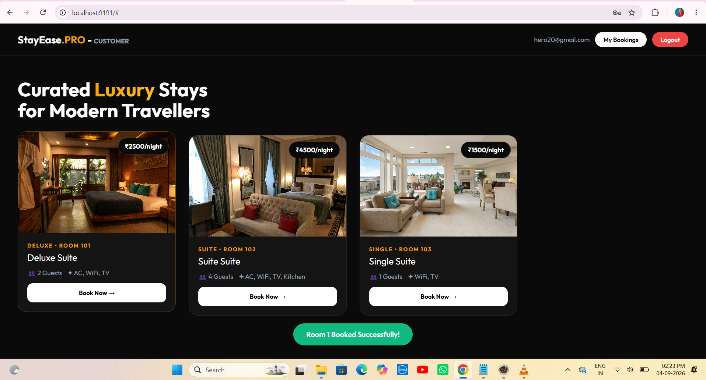
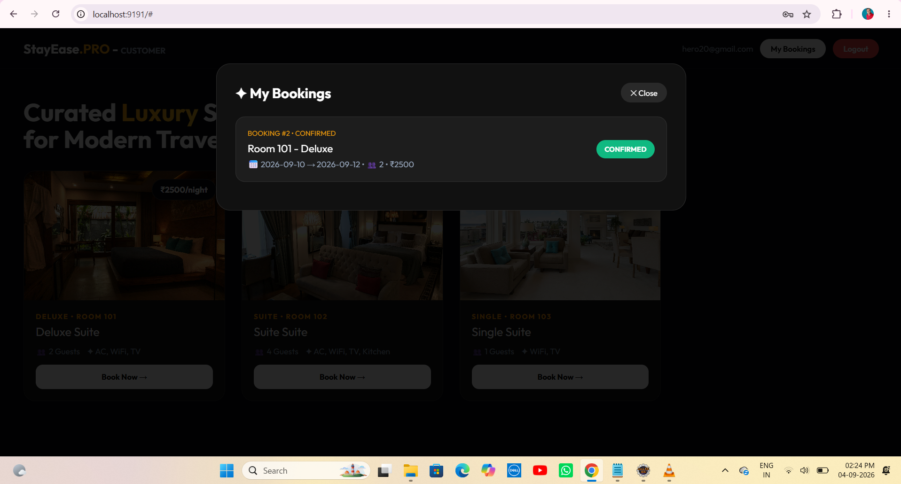
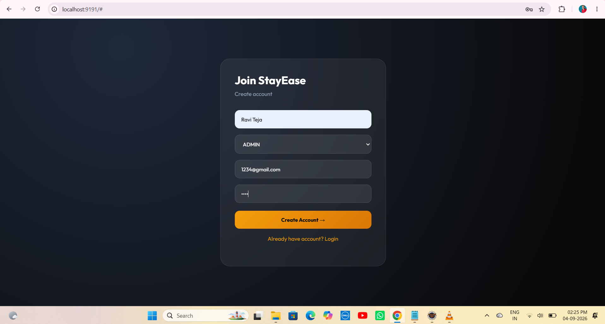
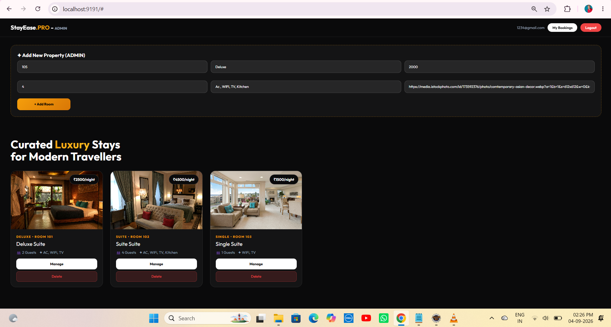
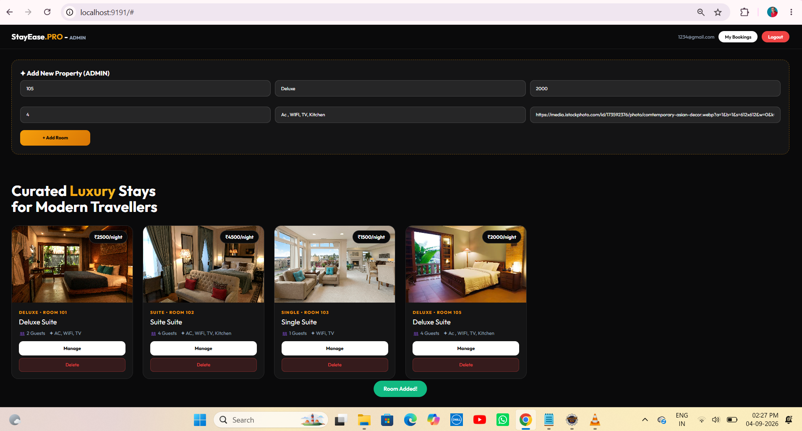
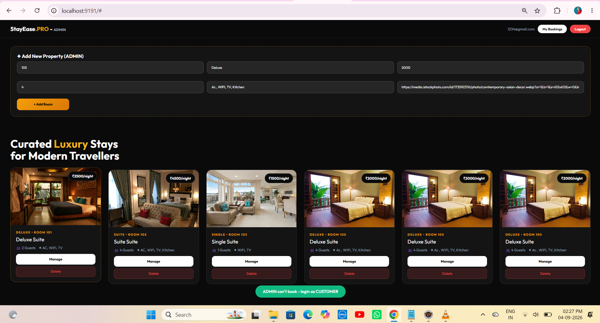
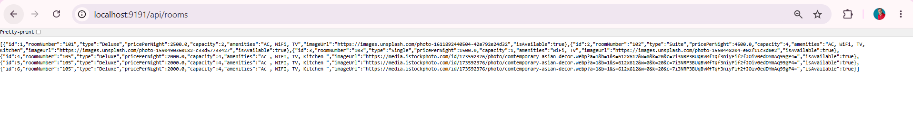
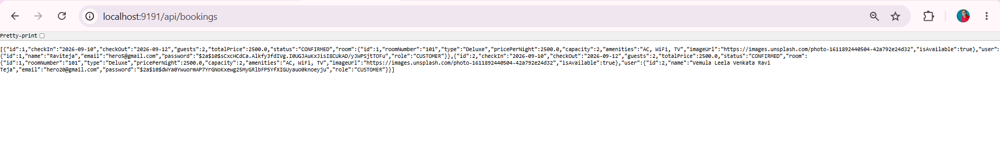

# 🏨 Project 68 – StayEase.PRO – Premium Booking System | Spring Boot + H2 + Bypass Full Stack

<p align="left">


</p>

📖 Project Overview

StayEase.PRO is Project 68 of Tier 7 – Full Stack Integration, built with Spring Boot 3.2.5, H2 Database, Spring Data JPA, Hibernate, Spring Security (Bypass Mode – permitAll) and Single File Premium Frontend served from src/main/resources/static/.

This project uses BYPASS FULL STACK architecture:

Frontend and Backend run on SAME port 9191 – http://localhost:9191/

No CORS issues, No separate React build – Single static/index.html with Vanilla JS

Backend serves frontend directly – Deploy as 1 JAR

Auth with CUSTOMER / ADMIN role selector + Simple Base64 Token + BCrypt

Login required to see rooms – Role based UI

Backend provides REST endpoints:

POST /api/auth/register – Register CUSTOMER/ADMIN

POST /api/auth/login – Login

GET /api/users/by-email?email= – Get user by email for booking FK

GET /api/rooms – List all luxury stays

POST /api/rooms – Add new property (ADMIN UI)

DELETE /api/rooms/{id} – Delete room (ADMIN)

POST /api/bookings – Book a room (CUSTOMER)

GET /api/bookings – All bookings JSON

GET /api/bookings/my/{email} – My Bookings feature

Frontend displays:

StayEase.PRO header with gold-black luxury branding

Join StayEase / Welcome Back – Glassmorphism dark auth card

Role selector – CUSTOMER / ADMIN

Curated Luxury Stays for Modern Travellers – Hero with gold Luxury gradient

Premium cards: image, ₹2500/night badge, DELUXE • ROOM 101 gold label, guests, amenities, Book Now →

ADMIN Dashboard – Add New Property – dashed gold border – 6 fields – Manage + Delete buttons

CUSTOMER Dashboard – Book Now → with green toast Room 1 Booked Successfully!

My Bookings modal – BOOKING #2 • CONFIRMED – Room 101 - Deluxe – dates – CONFIRMED badge

Role protection – ADMIN can't book - login as CUSTOMER toast

API verification pages – /api/rooms and /api/bookings JSON

✨ Features

🔐 Authentication – Bypass Simple

Register with Full Name, Email, Password, Role (CUSTOMER / ADMIN) – BCrypt hashed in H2

Login returns simple Base64 token email:role

Token + role + email stored in localStorage – Auto login on refresh

On H2 mem restart data is wiped – Need to re-register – Can switch to file H2 for persistence

🏨 Luxury Rooms Feed

Fetches all rooms from H2 via /api/rooms

Premium dark cards: image zoom hover, ₹ price badge top-right, gold type label, suite title, guests + amenities

3 sample rooms auto-added on start via DataLoader – Deluxe 101 2500, Suite 102 4500, Single 103 1500

Responsive grid – 3 columns desktop

➕ Admin Dashboard – Add New Property

Dashed gold border box – Add New Property (ADMIN)

6 inputs: Room No (105), Type (Deluxe), Price (2000), Capacity (4), Amenities (Ac, WiFi, TV, Kitchen), Image URL (Unsplash / iStock)

Add Room button – gold gradient – Green toast Room Added!

After adding, grid grows – Tested 4 rooms, 6 rooms – Proves scalability

Manage button (white) + Delete button (red dark) – ADMIN only

📚 My Bookings – Main Feature

Top-right My Bookings button – white pill – Beside user email and Logout red pill

Modal dark overlay with Close – Fetches via /api/bookings/my/{email}

Uses custom query BookingRepository.findByUser_Email(email)

Each booking card: BOOKING #2 • CONFIRMED gold, Room 101 - Deluxe, 📅 2026-09-10 → 2026-09-12 • 2 • ₹2500, CONFIRMED green badge

Empty state – No bookings yet

Booking creation links user FK – Uses /api/users/by-email?email= to get user id before POST

🛡️ Role Protection

ADMIN sees Add Room form + Manage + Delete – Cannot book – Shows toast ADMIN can't book - login as CUSTOMER

CUSTOMER sees Book Now → – Can book – Toast Room 1 Booked Successfully! – Can open My Bookings

🛠 Technologies Used

| Technology | Version | Purpose |
|---|---|---|
| Java | 21.0.10 | Backend language |
| Spring Boot | 3.2.5 | REST APIs, Embedded Tomcat |
| Spring Data JPA / Hibernate | 6.4.4.Final | ORM – Room, User, Booking |
| Spring Security | 6.2.4 | Bypass – permitAll() – No JWT filter |
| H2 Database | 2.2.x | In-memory / file DB – No setup – h2-console enabled |
| PasswordEncoder | BCrypt | Password hashing |
| Frontend | Single static/index.html – Vanilla JS | No React build – Bypass full stack |
| CSS | Pure CSS – Outfit font – Gold #F59E0B + Black #0A0A0B – Glassmorphism | Premium dark theme |
| Maven | 3.9+ | Build |

📂 Project Structure

```text
68-booking-system/
│
├── src/main/java/com/booking/
│   ├── Application.java – SpringBoot main + DataLoader Sample rooms added!
│   ├── config/
│   │   └── SecurityConfig.java – Bypass permitAll + BCrypt PasswordEncoder
│   ├── security/
│   │   └── JwtUtil.java – Simple Base64 token – No external JJWT lib
│   ├── controller/
│   │   ├── AuthController.java – /api/auth/register, /api/auth/login
│   │   ├── RoomController.java – /api/rooms GET, POST, DELETE
│   │   ├── BookingController.java – /api/bookings POST, GET, /my/{email} GET, DELETE
│   │   └── UserController.java – /api/users/by-email?email= – For booking FK mapping
│   ├── entity/
│   │   ├── User.java – id, name, email(unique), password, role CUSTOMER/ADMIN
│   │   ├── Room.java – id, roomNumber, type, pricePerNight, capacity, amenities, imageUrl, isAvailable
│   │   └── Booking.java – id, checkIn, checkOut, guests, totalPrice, status CONFIRMED, ManyToOne Room, ManyToOne User
│   ├── repository/
│   │   ├── UserRepository.java – findByEmail(String email)
│   │   ├── RoomRepository.java
│   │   └── BookingRepository.java – findByUser_Email(String email) – My Bookings query
│
├── src/main/resources/
│   ├── static/
│   │   └── index.html – Full App in ONE file – Auth + Customer Rooms + Admin Add + My Bookings Modal + Toasts – Classy Dark
│   └── application.properties – port 9191, H2 mem/file, ddl-auto, h2-console, show-sql
│
├── screenshots/ – 10 premium images
│   ├── 01-auth-customer.png
│   ├── 02-rooms-customer.png
│   ├── 03-booked-success.png
│   ├── 04-my-bookings-modal.png
│   ├── 05-auth-admin.png
│   ├── 06-admin-dashboard-3-rooms.png
│   ├── 07-admin-room-added.png
│   ├── 08-admin-6-rooms.png
│   ├── 09-api-rooms.png
│   └── 10-api-bookings.png
│
├── pom.xml – spring-boot-starter-web, data-jpa, security, H2
├── .gitignore – target/, data/, .idea/, *.db
└── README.md
```

▶ How to Run

1. Clone

```bash
git clone https://github.com/raviteja-dev950/68-booking-system.git
cd 68-booking-system
```

2. Application Properties

Current (in-memory – wipes on restart):

```properties
server.port=9191
spring.datasource.url=jdbc:h2:mem:bookingdb
spring.datasource.driver-class-name=org.h2.Driver
spring.datasource.username=sa
spring.datasource.password=
spring.jpa.hibernate.ddl-auto=create
spring.jpa.show-sql=true
spring.h2.console.enabled=true
spring.h2.console.path=/h2-console
```

For persistence (recommended for demo):

```properties
spring.jpa.hibernate.ddl-auto=update
spring.datasource.url=jdbc:h2:file:./data/bookingdb
```

3. Run – Single Command

```bash
mvn clean install -DskipTests
mvn spring-boot:run
```

Open:

http://localhost:9191/ – Frontend + Backend Same Port – StayEase.PRO

http://localhost:9191/api/rooms – Rooms JSON

http://localhost:9191/api/bookings – Bookings JSON

http://localhost:9191/h2-console – H2 console – JDBC URL jdbc:h2:mem – User sa – No password

4. Frontend Logic (Inside index.html)

```javascript
// Register
fetch('/api/auth/register', {method:'POST', headers:{'Content-Type':'application/json'}, body: JSON.stringify({name,email,password,role})})

// Login
fetch('/api/auth/login', {method:'POST', body: JSON.stringify({email,password})})

// Load rooms
fetch('/api/rooms').then(r=>r.json()).then(renderCards)

// Book – Get user id first for FK
let userRes = await fetch('/api/users/by-email?email='+localStorage.getItem("email"));
let user = await userRes.json();
fetch('/api/bookings', {method:'POST', body: JSON.stringify({room:{id}, user:{id: user.id}, checkIn, checkOut, guests, totalPrice})})

// My Bookings
fetch('/api/bookings/my/'+localStorage.getItem("email"))
```

🔄 Application Flow

```text
Browser
 │
 ▼
http://localhost:9191/ – static/index.html
 │
 ├── Auth Box – Join StayEase / Welcome Back – Glass card – Name, Role CUSTOMER/ADMIN, Email, Password – Orange button
 │   ├── POST /api/auth/register – BCrypt save – Return Base64 token – Save to localStorage
 │   └── POST /api/auth/login – findByEmail – BCrypt matches – Return token
 │
 ├── MainApp – if token exists – StayEase.PRO header – CUSTOMER or ADMIN badge – My Bookings + Logout
 │   ├── CUSTOMER:
 │   │   ├── Hero – Curated Luxury Stays for Modern Travellers
 │   │   ├── Grid – /api/rooms – Book Now → – POST /api/bookings – Toast Room 1 Booked Successfully!
 │   │   └── My Bookings – GET /api/bookings/my/email – Modal BOOKING #2 CONFIRMED
 │   └── ADMIN:
 │       ├── Add New Property dashed gold box – POST /api/rooms – Room Added! – Grid grows to 6
 │       ├── Cards Manage + Delete – DELETE /api/rooms/{id}
 │       └── Book click – Toast ADMIN can't book - login as CUSTOMER
 │
 └── Logout – localStorage.clear()
 │
 ▼
Spring Boot 9191 – Single JAR – permitAll
 │
 ▼
H2 – tables: users, room, booking – Sample rooms added! on start
```

🧪 API Testing

```bash
curl http://localhost:9191/api/rooms

curl -X POST http://localhost:9191/api/auth/register -H "Content-Type: application/json" -d "{\"name\":\"Vemula Leela Venkata Ravi Teja\",\"email\":\"hero20@gmail.com\",\"password\":\"1234\",\"role\":\"CUSTOMER\"}"

curl -X POST http://localhost:9191/api/auth/register -H "Content-Type: application/json" -d "{\"name\":\"Ravi Teja\",\"email\":\"1234@gmail.com\",\"password\":\"1234\",\"role\":\"ADMIN\"}"

curl -X POST http://localhost:9191/api/auth/login -H "Content-Type: application/json" -d "{\"email\":\"hero20@gmail.com\",\"password\":\"1234\"}"

curl "http://localhost:9191/api/users/by-email?email=hero20@gmail.com"

curl -X POST http://localhost:9191/api/bookings -H "Content-Type: application/json" -d "{\"room\":{\"id\":1},\"user\":{\"id\":2},\"checkIn\":\"2026-09-10\",\"checkOut\":\"2026-09-12\",\"guests\":2,\"totalPrice\":2500.0}"

curl http://localhost:9191/api/bookings/my/hero20@gmail.com

curl http://localhost:9191/api/bookings
```

📡 API Endpoints

| Method | Endpoint | Access | Purpose |
|---|---|---|---|
| POST | /api/auth/register | Public | Join StayEase – CUSTOMER/ADMIN |
| POST | /api/auth/login | Public | Welcome Back |
| GET | /api/users/by-email?email= | Public | Get user id for booking FK |
| GET | /api/rooms | Public | Luxury stays grid |
| POST | /api/rooms | Public | ADMIN Add New Property |
| DELETE | /api/rooms/{id} | Public | ADMIN Delete |
| POST | /api/bookings | Public | CUSTOMER Book Now |
| GET | /api/bookings | Public | All bookings |
| GET | /api/bookings/my/{email} | Public | My Bookings modal |

🗄 Database Note – H2

H2 uses GenerationType.IDENTITY – Auto increment – No sequence needed.

Tables

users – id, email UNIQUE, name, password BCrypt, role

room – id, room_number, type, price_per_night, capacity, amenities, image_url, is_available

booking – id, check_in, check_out, guests, total_price, status CONFIRMED, room_id FK, user_id FK

DataLoader adds 3 rooms on start if count==0 – Prints Sample rooms added!

H2 Console: http://localhost:9191/h2-console – JDBC URL jdbc:h2:mem – User sa

Important: With mem + create, data wiped on restart – User not found after restart – Fix: Re-register or switch to file:./data/bookingdb + update.

Verified

/api/rooms – 3 to 6 rooms JSON

/api/bookings – bookings with nested room and user

📸 Screenshots – StayEase.PRO Classy Dark

1. Auth CUSTOMER – Join StayEase – CUSTOMER



2. Customer Dashboard – StayEase.PRO – CUSTOMER



3. Booking Success – Green Toast Room 1 Booked Successfully!



4. My Bookings Model – BOOKING #2 • CONFIRMED



5. Auth ADMIN – Join StayEase – ADMIN



6. Admin Dashboard – Add New Property – 3 Rooms



7. Admin Add Room Success – 4 Rooms – Room Added!



8. Admin 6 Rooms – Role Protection



9. API /api/rooms JSON – 6 Rooms



10. API /api/bookings JSON – Bookings with User and Room



🎯 Learning Outcomes

Bypass Full Stack – Single static/index.html served by Spring Boot on same port 9191 – Single JAR – No CORS

H2 Database – mem vs file – create vs update – DataLoader sample rooms

Security Bypass – permitAll() – Fast Tier 7

Simple Token – Base64 email:role – localStorage

My Bookings Feature – findByUser_Email custom query – ManyToOne – Modal UI

Role UI – if ADMIN shows Add + Manage/Delete else Book Now – Toast protection

Classy Dark – Gold #F59E0B + Black #0A0A0B + Glassmorphism + Outfit font + Price badges + Hover

Booking FK fix – /api/users/by-email endpoint

Toast UX – Green pills Room Booked, Room Added

API verification – /api/rooms and /api/bookings

🚀 Future Enhancements

Add real JWT filter – Authorization Bearer

Switch H2 mem to file for persistence

Switch H2 to MySQL/PostgreSQL

Add date picker for checkIn/checkOut

Add payment mock

Add cancel booking DELETE /api/bookings/my/{id}

Add search filter by price, capacity, type

Add pagination

Deploy to Render/Railway – java -jar

Add React frontend later – 2 ports

👨‍💻 Author

Ravi Teja – Vemula Leela Venkata Ravi Teja

Java Full Stack Developer

100 Java Full Stack Projects Challenge

Project 68 / 100 – Bypass Track – StayEase.PRO

Tier 7 – Full Stack Integration – Single Port 9191

Test Accounts

hero20@gmail.com – CUSTOMER

1234@gmail.com – ADMIN

⭐ Support

If you found this project helpful, give it a ⭐ Star on GitHub!

Repo

https://github.com/raviteja-dev950/68-booking-system

Run

mvn spring-boot:run

Open:

http://localhost:9191/

Register CUSTOMER:

hero20@gmail.com -> Book -> My Bookings

Register ADMIN:

1234@gmail.com -> Add Room 105 -> Manage + Delete
